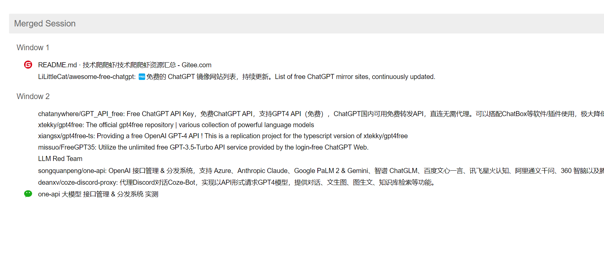

<h1 align="center">
  <a href="https://github.com/Ai-trainee/AI-Project-Hub">🌟 AI-Project-Hub 🌟</a>
</h1>

  <a href="README.md">English</a> |
  <a href="docs/languages/README_cn.md">简体中文</a>

✨ 我是Aitrainee | AIGC技术实践者 🚀 

🎵 知音难求，自我修炼亦艰

📚 吾生也有涯，而知也无涯🌌

把握AIGC时代的个人力量：

抓住前沿技术的机遇，与我们一起成为创新的超级个体。 

🎉AI社群 | 我的微信，点击此处：<a href="https://mlink.cc/aitrainee">一键直达</a> 🚀

# 5月最新大盘点：Gpt4-o国内直连共享账号、GPT34 API开源项目！
[点击此处：下载本地打开即可](doc/2.html)

 
# 共享GPT4-o账号
| **标题**                                                                                    | **资源/项目地址**                                                                                                                                                                                                                                                                                                           |
|-------------------------------------------------------------------------------------------|-----------------------------------------------------------------------------------------------------------------------------------------------------------------------------------------------------------------------------------------------------------------------------------------------------------------------
| 最新AI-GPT4o，国内免费使用，官网账户直登                                                         | [RawChat](https://chat.rawchat.cc/)    [共享账户](doc/共享账号/1.md)                                                                                                                                                                                                                                                       |
| PandoraNext倒下了，国内免费使用ChatGPT4的最新方法                                                | RawChat项目：[https://github.com/RawChat/RawChat](https://github.com/RawChat/RawChat) 共享站：[https://sharedchat.cn/shared.html](https://sharedchat.cn/shared.html) 免费GPT4：[free01.xyz](http://free01.xyz) 免费GPT4：[cc.gpt4fr.ee](https://cc.gpt4fr.ee) 字节跳动Coze: [https://www.coze.com/](https://www.coze.com/) |
